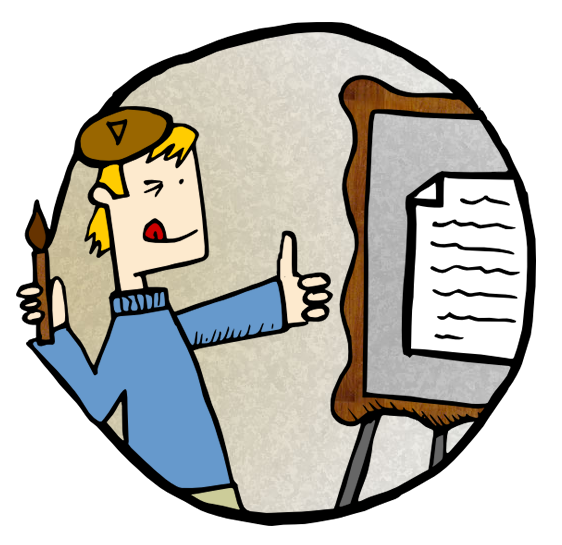
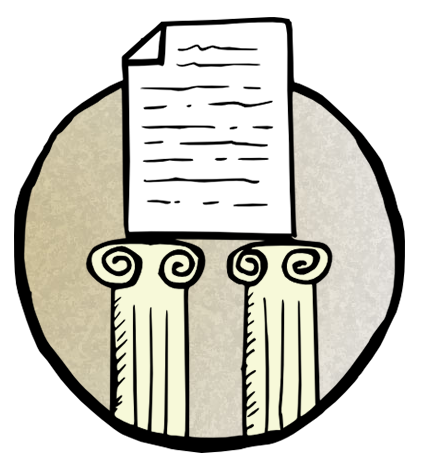

{::nomarkdown}

  
Users approach online content very differently than they do print  material. They are on a hunt, and follow a scent of information. They actively search for information &minus; rather than passively accept the  information as it is presented. Users quickly  scan webpage information to see if they can find what they seek. Rather than  read each word, users scan online text, and look for keywords and familiar phrases.  If they don't immediately find it, they move on, and are  unlikely to return to a site that didn't suit their needs.

  
To reach users, write information that users can quickly scan, and find  what they need. As well, rewrite all content originally intended for   print so it suits a web audience.

  

        

		

            

             

              
<a href="dvlpmnt-en.html">Content development</a>

              
Information on content strategy and context (the users and their tasks). Details also include what content to reuse, recycle, and reduce.

			  

			

        

        

          

		  

            

             

              
<a href="rchtctr-en.html">Content architecture</a>

             
Information on how to organize, present, structure and alphabetize content. Details also include proper page length, as well as the use of content blocks and <abbr title="Frequently asked questions">FAQ</abbr> sections. 

			 

			

        

  

	  

        

        

		

            

             

              
<a href="stl-en.html">Content style and flow</a>

              
Information on how to write in plain language with concise text that is parallel in structure. Details also include how to create a consistent layout with predictable content.

			  

			

        

        

          

		  

            

             

              
<a href="strctr-en.html">Content structure and presentation</a>

              
Information  on proper document formats, headings, and links. Details also include how to  effectively present key elements such as lists, images, tables, colours and  fonts.

			  

			

        

  


{:/}
